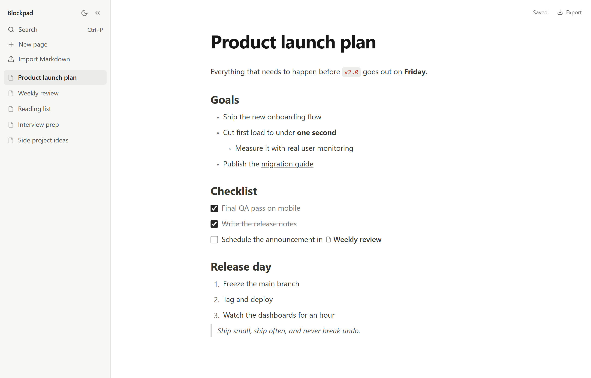
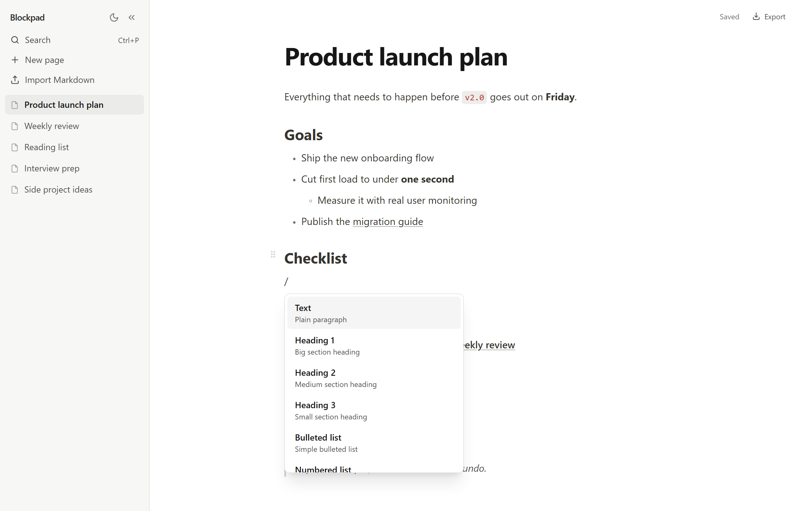
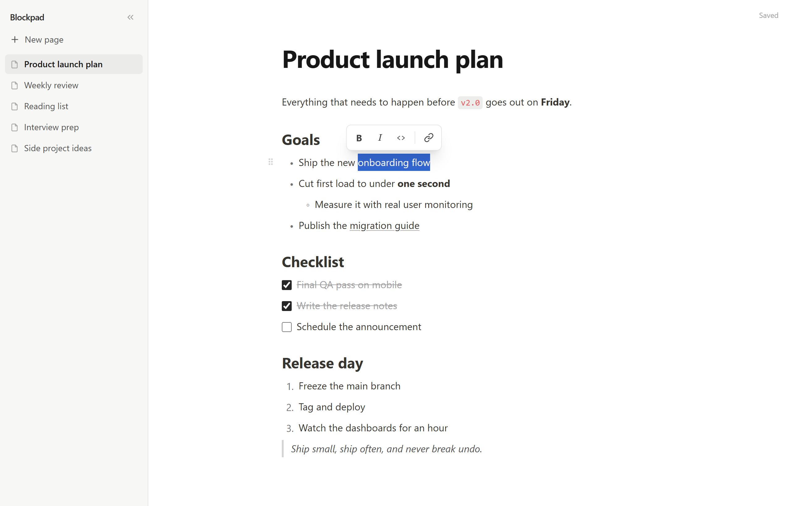
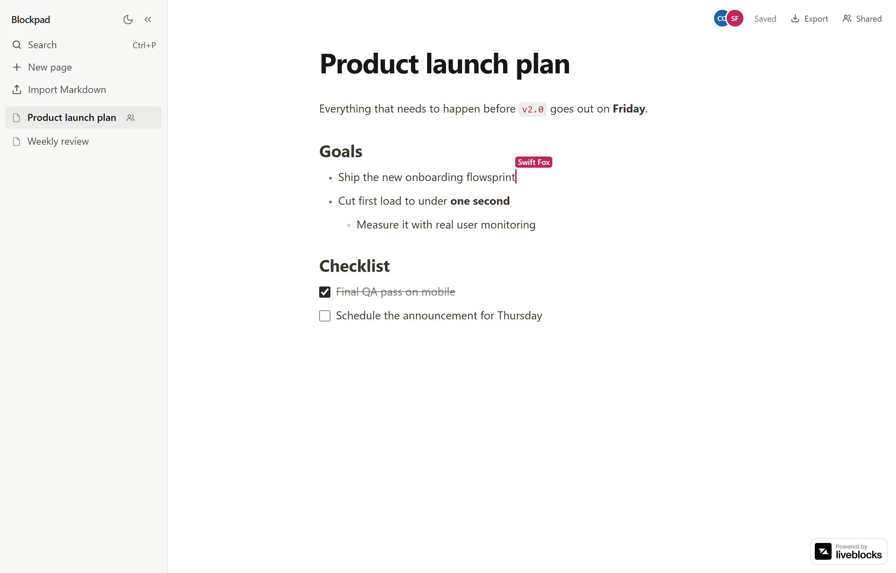
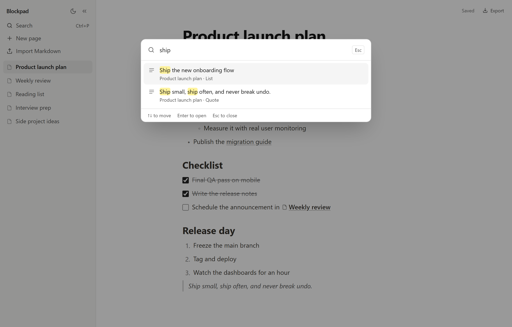
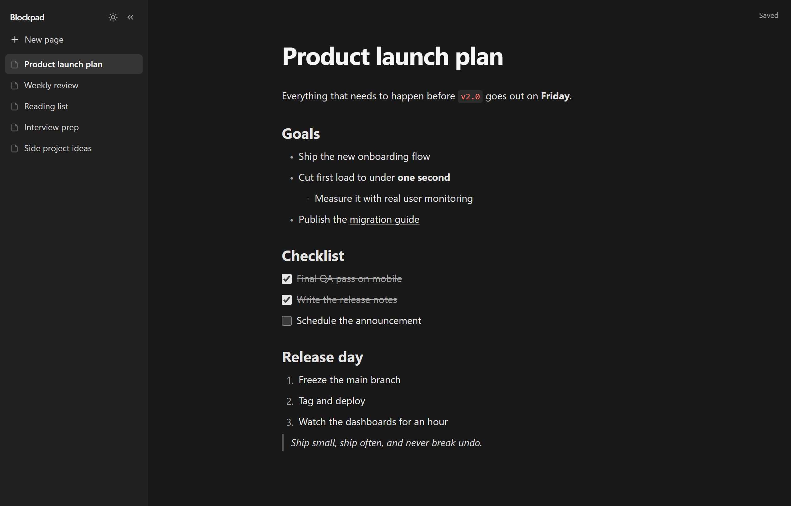

# Blockpad

A block-based document editor in the browser, in the style of Notion. Pages of notes where every paragraph, heading and list item is a block you can type in, format, convert, indent and drag around.

Built from scratch with React and TypeScript — no editor framework. Cursor tracking, splitting and merging blocks, paste handling, formatting and undo are all hand-written on top of `contenteditable`.

**[Try it live →](https://blockpad-five.vercel.app)**



## What it does

- **Pages** — a sidebar of documents. Create, switch and delete them; each page keeps its own undo history.
- **Quick search** — `Ctrl+P` searches every page's title and text, highlights the matches, and opens the result with the cursor on the matching word.
- **Page links and backlinks** — type `[[` to link another page, or create one on the spot. Links follow renames, turn back into text when their page is deleted, and every page lists the places that link to it.
- **Markdown in and out** — export a page as a `.md` file, or import files by picking or dragging them in. Nested lists, to-dos, formatting and `[[links]]` survive the round trip.
- **Live collaboration** — share a page with a link and edit it together in real time. Other people's cursors and names show where they're typing, your cursor stays put when they type before it, and undo only takes back your own edits. Built on Yjs, a CRDT, synced through Liveblocks.
- **Slash menu** — type `/` to insert or convert a block: text, three heading levels, bulleted, numbered and to-do lists, quote, divider.
- **Formatting toolbar** — select text for bold, italic, inline code and links. Unsafe addresses such as `javascript:` links are refused.
- **Markdown shortcuts** — `# ` becomes a heading, `- ` a bullet, `1. ` a numbered item, `> ` a quote, `[] ` a to-do. Leading spaces become indentation.
- **Nested lists** — Tab and Shift+Tab. Numbering restarts at each level and resumes when you come back out.
- **Clean paste** — text copied from a web page or Google Docs keeps its bold, italic, code and links, and drops colours, fonts and sizes. Several lines become several blocks.
- **Drag to reorder** — grab the handle that appears on hover.
- **Undo and redo** — continuous typing collapses into one step; structural edits are their own.
- **Autosave** to the browser's local storage.
- **Keyboard and screen-reader friendly** — Escape leaves the editor so Tab can move on, blocks move with Ctrl+Shift+Arrow, the slash menu announces the highlighted option, and text meets WCAG AA contrast.
- **Works on phones** — the sidebar floats over the page, and controls that rely on hover stay visible on touch screens.
- **Dark mode** — follows the system setting until you flip the switch in the sidebar, then remembers your choice. The theme is set before the first paint, so there is no white flash, and both themes meet WCAG AA contrast.

<p>
  
  
</p>







### Keyboard

| Keys | Action |
| --- | --- |
| `/` | Open the block menu |
| `[[` | Link another page |
| `Ctrl/Cmd + Enter` beside a link | Open the linked page |
| `Ctrl/Cmd + P` | Search all pages |
| `Enter` | Split the block at the cursor; on an empty list item, leave the list |
| `Backspace` at line start | Turn a styled block back into text, or merge into the line above |
| `Delete` at line end | Pull the next line up |
| `↑` / `↓` | Move between blocks, keeping the cursor's horizontal position |
| `Tab` / `Shift+Tab` | Indent / outdent |
| `Ctrl/Cmd + Shift + ↑` / `↓` | Move the current block up / down |
| `Esc` | Leave the editor, so `Tab` moves on to the next control |
| `Ctrl/Cmd + B`, `I`, `E` | Bold, italic, inline code |
| `Ctrl/Cmd + K` | Link the selected text |
| `Ctrl/Cmd + Z` | Undo |
| `Ctrl/Cmd + Shift + Z`, `Ctrl + Y` | Redo |

## How it works

**One `contenteditable` per block, not one for the whole document.** A single editable region means fighting the browser over DOM structure on every keystroke. Per-block keeps native cursor behaviour inside a line, and makes every cross-block operation explicit.

**A pure document model.** A page is plain data — blocks holding runs of formatted text. Every operation (split, merge, move, indent, change type, apply a format) is a pure function that returns a new document. That makes the core directly unit-testable, and makes undo history a list of previous versions.

**The DOM is the source of truth while you type.** If React re-rendered a block's content on every keystroke, the cursor would jump to the start. So typing never touches the model; a block's text is committed back at structural moments — Enter, Backspace at a line start, switching pages — and on a short debounce for autosave.

**Cursor translation.** Browsers report the cursor as a DOM node plus an offset inside it. The model wants a single character offset within a block. `src/editor/caret.ts` converts between the two in both directions, which is what lets a merge land the cursor exactly at the seam.

**Links are islands.** A page link is a formatted run of text that carries a page id instead of a URL, rendered as a non-editable element — so the browser deletes it whole and never lets typing land inside it. Its text is the page's title, refreshed from the page list whenever a page opens.

**Markdown both ways, as pure functions.** Export and import live in the model, with no DOM. A round-trip test exports a page containing every block type and mark, imports the result, and expects the same page back.

**Collaboration without rewriting the editor.** The editor still works on plain page data. For a shared page, a bridge (`src/collab/yjsModel.ts`) compares each change with the shared Yjs document and applies only what differs — the characters between an unchanged start and end, or a formatting change in place — so two people typing in one line both keep their text, and bolding a range doesn't wipe out someone typing inside it. Remote changes come back as plain data plus exactly what moved in each line, which is how your cursor holds its place. Cursors are shared as Yjs relative positions, which point at a character rather than a number. The collaboration code is a separate chunk, downloaded only when a shared page opens.

**Storage.** Each page is saved under its own key alongside a small index of page titles, so typing in one page never rewrites the others. Notes written before pages existed are migrated into the first page on load.

### Problems worth knowing about

Most bugs in this project were timing and lifecycle problems between React and the DOM, not logic errors — the pure model was correct every time.

- **State updaters must be pure.** React's StrictMode calls `setState` updater functions twice. Generating block IDs inside one minted two different IDs and left the cursor pointing at a block that didn't exist; mutating undo history inside one pushed and popped every entry twice.
- **React only cleans up what React created.** Converting a paragraph into a list reused the same `<div>` as a new layout container, and text written into it with `innerHTML` survived inside it. Keying each block's markup by its type forces a clean remount.
- **Debounced work outlives the moment it was scheduled for.** A delayed autosave commit could fire after you had moved to another line and drag the cursor back. And starting to type in a second line cancelled the first line's pending commit, so its text was never saved.
- **Closing a tab never unmounts React.** The close-tab save wrote the document model, but text typed in the last half second still existed only in the page — so a quick close or reload lost it. Leaving now commits every block straight from the DOM before saving.
- **A merge reads its neighbour too.** Delete at the end of a line committed the current line but read the next one from a model that hadn't seen its latest typing — so it merged in an empty line and then removed it, silently deleting text.
- **Pasted HTML lies.** Google Docs wraps everything you copy in `<b style="font-weight:normal">`. A parser that trusts tags turns every paste bold.
- **Focus is not the cursor.** Closing the search dialog handed focus back to the line you were on, but `focus()` on editable text puts the cursor at its start — so the next thing you typed landed in the wrong place. The dialog now saves and restores the exact selection.
- **A cursor can sit where typing is impossible.** Right after a page link, the browser happily places the cursor inside the link's non-editable text. Cursor placement now snaps to just before or after a link.
- **Remote edits arrive in bursts.** When someone types quickly before your cursor, their keystrokes arrive in batches — sometimes several before React has drawn the first. Two bugs hid here: keeping only the last change per line, and working out the next shift from the cursor on screen, which hadn't moved yet. Either left your cursor a few characters behind. A test now types twenty characters in a burst before another person's cursor and checks it moved by exactly twenty.
- **`localhost` is not always `127.0.0.1`.** On Windows the local sync server answered over HTTP but refused WebSocket connections, because `localhost` resolved to IPv6 first and the socket never fell back to IPv4.

## Running it

```bash
git clone https://github.com/ManasMahato-0/Blockpad.git
cd Blockpad
npm install
npm run dev      # development server
npm test         # unit tests
npm run build    # production build
```

Live collaboration needs a [Liveblocks](https://liveblocks.io) public key; without one the Share button stays hidden and everything else works. To develop it locally with no account, run the Liveblocks dev server and point the app at it in `.env.development.local`:

```bash
docker run --rm -p 1153:1153 ghcr.io/liveblocks/dev-server
```

```ini
VITE_LIVEBLOCKS_PUBLIC_KEY=pk_localdev
VITE_LIVEBLOCKS_BASE_URL=http://127.0.0.1:1153
```

Unit tests cover the document model: text slicing and formatting marks, the Enter, Backspace and Delete rules, pasting several lines, indentation limits, the markdown shortcut matcher, the page list, search ranking, page links and backlinks, Markdown import and export, and the collaboration bridge — including two replicas editing the same line at once and merging to the same result.

## Stack

React 19, TypeScript, Vite, Tailwind CSS v4 and Vitest, deployed on Vercel. Shared pages use Yjs for the CRDT and Liveblocks to sync it; both load only when a shared page is opened.

## Scope

Deliberately left out: selecting across several blocks, image upload, accounts and permissions. Private pages live in the browser's local storage, on the device they were written on. A shared page lives in its Liveblocks room, and **anyone with its link can view and edit it** — the link is the only key, so share it the way you'd share a document with link editing turned on.

## Licence

MIT — see [LICENSE](LICENSE).
